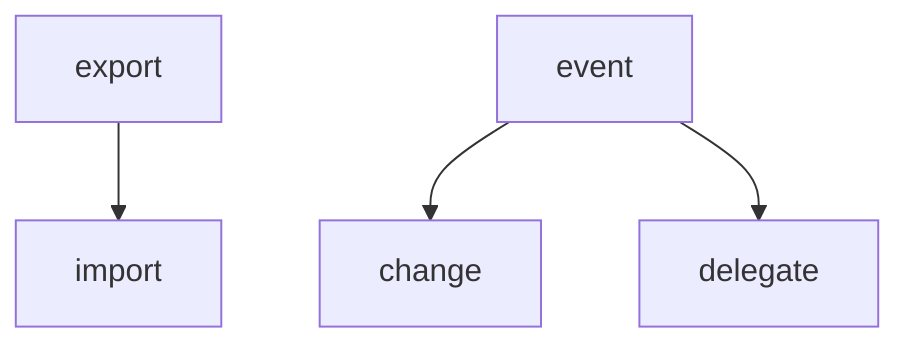
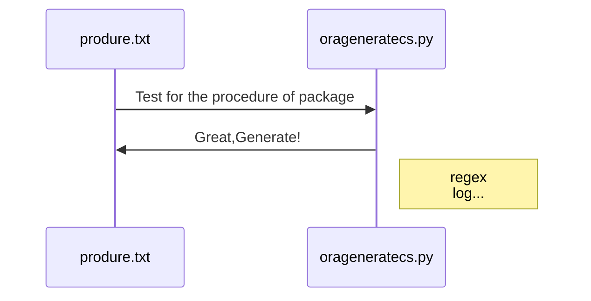

# Tools
> CSharp 测试
 - database 简单封装Redis和MongoDB
 - EF 对.net Core的EntityFramework进行实践，除Mssql没问题，其他的数据库接口有报错
 - Mess 杂物堆
   - send mail
   - xml ReadAndWrite
   - sql duplicate quote
   - Test for Attibute
> js JavaScript 测试
 + 对jquery仿写,了解原理
```
function BaseObject(element){
    this.elements= element;
}
function a(name){
    var element = document.querySelectorAll(name);
    return new BaseObject(element);
}
BaseObject.prototype.change=function(callback){
}
```
 + mermaid https://mermaidjs.github.io/

 + Nodejs里的require exports 
> Python 工作时的便利
 * 简单测试
 * 统计代码，生成cs文件
 * 根据oracle的packages Test打印OracleParameter[]
